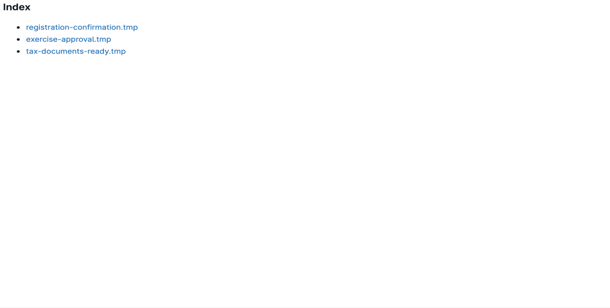

# Email Templating - Frontend Project

To get this project up and running, you'll need to refer to both the READMEs in the `/client` and `/server` directories and have a server running for each.

## Assignment Details and Requirements
The premise for this app is to create an email template preview and editor from a select list of available templates that's fetched from the backend.

The app's landing page needs to display a list of all of the templates. For the purpose of this project, there are no directories or hierachy, and there's no need to `delete` or `add` templates. From the landing page, we only need to `view` the template.

From the listing page, when clicking on a link, we're able to navigate to each of the templates. Each of the template views should allow us to save and preview the templates given a body that contains the html for the email, and a component to add contextual variables.

As pictured above, the template body should appear on the right half of the screen alongside an area to define the contextual variables. There should be a "Save" button to save changes to the template, and a "Preview" button to preview the template when all contextual variables are added.

## Component Architecture
When considering the component architecture for this app, the landing page is very simple. Since we set up the routes in a way that avoids repeating code by iterating over each element in the fetch that gives us a list of all templates, we're able to create a `<Link />` to each of those routes using the same list of templates. Since this component was simple, it wasn't necessary to create a completely new component just to render the list.

The fun starts when we start looking at the component architecture for the view template pages.

With the above screenshot, the intention was to have a `<Header />` component and `<EmailTemplate />` be sibling components, but given the simplicity of the items in the header with the [creative liberty](#design-considerations-and-tweaks-creative-liberty) I made to make the experience for the user better, I made the header component inline as opposed to creating a separate `<Header />` component for it. If it was any more complicated, I would've created a separate component for it.

Inside of the `<EmailTemplate />` component, the child components were broken up into two different panels, one for the `<EmailTemplatePreview />` component and the other was for two instances of the `<EmailTemplateEditor />` component, one for the html content of the email, and one for the context variables. Since the original design showed the same structure, just different content, I reused the `<EmailTemplateEditor />` component for both, and just added rendering logic for the type of content that needs to be displayed.

The `<EmailTemplateEditor />` component itself was simple. A header, and a body with the `<textarea>` tag. Except that I tweaked the experience for the contextual variables described in the [creative liberty](#design-considerations-and-tweaks-creative-liberty) section.

## Design Considerations and Tweaks (Creative Liberity)
During the project, I took a couple creative liberties from the original spec in order to create for a more intuitive user experience. Of those include:
- Moving 'Save' and 'Preview' buttons to make space to navigate back to list of templates
- Add success and failure alerts on save success/failure
- Instead of one big `<textarea>`, we parsed for a list of all required contextual variables and displayed an input field for each one. This made it more intuitive for users to know what variables are needed, and simplified the experience for entering context variables. They don't need to manage the JSON on their own.

## Improvements
- Making more input and buttons more accessible. Should be able to hit every element in a logical order with tab.
- High contrast mode
- Mobile friendly
- More interactive - button interactions on hover, click, focus etc.